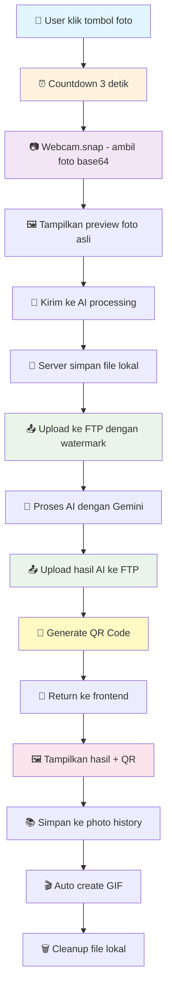

# 📸 Alur Lengkap DigiOH Photobooth: Foto → AI → FTP → QR Code

Berdasarkan analisis mendalam kode yang ada, berikut adalah penjelasan lengkap alur dari pengambilan foto hingga pembuatan QR code:

## 🔄 **DIAGRAM ALUR UTAMA**



## 📋 **TAHAP 1: PENGAMBILAN FOTO**

### **A. Countdown & Capture** ⏰
```javascript
// Di App.jsx - startCountdown function
const startCountdown = () => {
  if (isLoading || countdown > 0) return
  
  setCountdown(3)
  const countdownInterval = setInterval(() => {
    setCountdown(prev => {
      if (prev <= 1) {
        clearInterval(countdownInterval)
        takePhoto() // Ambil foto setelah countdown
        return 0
      }
      return prev - 1
    })
  }, 1000)
}
```

**Visual Countdown:**
- ⏰ **3 detik** dengan animasi visual
- 🎯 **Full screen overlay** dengan animasi dramatic
- ❌ **Tombol batal** untuk membatalkan pengambilan

### **B. Capture Foto** 📷
```javascript
// Di App.jsx - takePhoto function
const takePhoto = async () => {
  const video = videoRef.current
  const {videoWidth, videoHeight} = video
  const squareSize = canvas.width
  
  // Ambil foto dari video stream
  ctx.clearRect(0, 0, squareSize, squareSize)
  ctx.setTransform(1, 0, 0, 1, 0, 0)
  ctx.scale(-1, 1) // Mirror effect
  ctx.drawImage(video, sourceX, sourceY, sourceSize, sourceSize, -squareSize, 0, squareSize, squareSize)
  
  const photoData = canvas.toDataURL('image/jpeg')
  const photoId = await snapPhoto(photoData) // Kirim ke AI processing
}
```

**Proses Capture:**
1. **Canvas processing** - Ambil frame dari video stream
2. **Mirror effect** - Balik gambar untuk selfie
3. **Square crop** - Potong menjadi bentuk persegi
4. **Base64 conversion** - Konversi ke format base64

## 🤖 **TAHAP 2: AI PROCESSING**

### **A. Snap Photo Function** 🎯
```javascript
// Di actions.js - snapPhoto function
export const snapPhoto = async b64 => {
  const id = crypto.randomUUID()
  const {activeMode, customPrompt} = get()
  imageData.inputs[id] = b64

  set(state => {
    state.photos.unshift({id, mode: activeMode, isBusy: true})
  })

  try {
    const result = await gen({
      model: 'gemini-2.0-flash-preview-image-generation',
      prompt: activeMode === 'custom' ? customPrompt : modes[activeMode].prompt,
      inputFile: b64
    })
    
    imageData.outputs[id] = result
    // Update state - photo selesai diproses
  } catch (error) {
    // Error handling
  }
}
```

**AI Processing:**
- 🎨 **Mode selection** - Pilih style AI (renaissance, cyberpunk, dll)
- ✏️ **Custom prompt** - User bisa input prompt custom
- 🤖 **Gemini API** - Proses dengan Google Gemini 2.0
- ⏳ **Loading state** - Tampilkan loading saat proses

### **B. AI Modes** 🎨
```javascript
// Di modes.js - Available AI modes
export default {
  renaissance: {
    name: 'Renaissance',
    emoji: '🎭',
    prompt: 'Renaissance painting style, oil painting, classical art, dramatic lighting'
  },
  cyberpunk: {
    name: 'Cyberpunk',
    emoji: '🤖',
    prompt: 'Cyberpunk style, neon lights, futuristic, digital art'
  },
  custom: {
    name: 'Custom',
    emoji: '✏️',
    prompt: '' // User input
  }
}
```

## 📤 **TAHAP 3: FTP UPLOAD**

### **A. Upload Process** 🚀
```javascript
// Di App.jsx - uploadToFTP function
const uploadToFTP = async (imageUrl, filename) => {
  const formData = new FormData()
  formData.append('file', blob, filename)
  formData.append('name', filename)
  
  const uploadResponse = await fetch('/api/upload', {
    method: 'POST',
    body: formData
  })
  
  const result = await uploadResponse.json()
  return {
    url: result.directLink,
    qrCode: result.qrCode
  }
}
```

### **B. Server-side Upload** 🖥️
```javascript
// Di server.js - /api/upload endpoint
app.post('/api/upload', upload.single('file'), async (req, res) => {
  const timestamp = Date.now()
  const filename = `DigiOH_PhotoBox_${timestamp}.${extension}`
  const remoteFile = `_sfpg_data/image/${filename}`
  
  // Simpan file lokal dulu
  const localPath = path.join(__dirname, 'uploads', filename)
  fs.writeFileSync(localPath, req.file.buffer)
  
  // Upload ke FTP dengan watermark
  const result = await copyFile(localPath, remoteFile)
  
  // Generate QR code
  const qrDataURL = await QRCode.toDataURL(result, {
    width: 300,
    margin: 2,
    color: { dark: '#000000', light: '#FFFFFF' }
  })
  
  res.json({
    success: true,
    directLink: result,
    qrCode: qrDataURL,
    filename: filename
  })
})
```

### **C. FTP dengan Watermark** 🎨
```javascript
// Di ftpUtils.js - copyFile function
export async function copyFile(fileUrl, remoteFile) {
  const localFile = path.basename(fileUrl)
  const localFilePath = path.join(uploadsDir, localFile)
  const watermarkedFilePath = path.join(uploadsDir, 'watermarked_' + localFile)
  const watermarkPath = path.join(__dirname, 'watermarkdigioh.png')

  // Download file
  await downloadFile(fileUrl, localFilePath)

  // Tambahkan watermark
  await addWatermark(localFilePath, watermarkPath, watermarkedFilePath)

  // Upload ke FTP
  const result = await uploadFile(watermarkedFilePath, remoteFile)
  
  // Cleanup file lokal
  fs.unlinkSync(localFilePath)
  fs.unlinkSync(watermarkedFilePath)
  
  return result
}
```

**Watermark Process:**
- 🖼️ **Load watermark** - `watermarkdigioh.png`
- 📏 **Calculate size** - 20% dari lebar gambar
- 📍 **Position** - Bottom right dengan margin 20px
- 🎨 **Composite** - Gabungkan dengan Sharp library
- 💾 **Save** - Simpan sebagai JPEG quality 90%

## 📱 **TAHAP 4: QR CODE GENERATION**

### **A. Generate QR Code** 🔗
```javascript
// Di server.js - QR Code generation
const qrDataURL = await QRCode.toDataURL(result, {
  width: 300,
  margin: 2,
  color: {
    dark: '#000000',
    light: '#FFFFFF'
  }
})
```

**QR Code Features:**
- 📏 **Size** - 300x300 pixels
- 🎨 **Colors** - Black on white
- 📱 **Margin** - 2 unit margin
- 🔗 **Content** - URL ke file di FTP server

### **B. Display QR Code** 🖼️
```javascript
// Di App.jsx - QR Code display
{showQRCode && qrCodeUrl && (
  <div className="qrModal">
    <div className="qrContent">
      <div className="qrHeader">
        <h2>📱 Scan QR Code untuk Download</h2>
      </div>
      <div className="qrBody">
        
        <div className="qrInstructions">
          <h4>📱 Cara Download:</h4>
          <ol>
            <li>Buka kamera HP Anda</li>
            <li>Arahkan ke QR Code ini</li>
            <li>Klik link yang muncul</li>
            <li>Download foto Anda! ✨</li>
          </ol>
        </div>
      </div>
    </div>
  </div>
)}
```

## 🎬 **TAHAP 5: GIF CREATION**

### **A. Auto GIF Creation** 🎞️
```javascript
// Di actions.js - makeGif function
export const makeGif = async () => {
  const {photos} = get()
  const gif = new GIFEncoder()
  const readyPhotos = photos.filter(photo => !photo.isBusy)

  for (const photo of readyPhotos) {
    // Add original photo frame
    const inputImageData = await processImageToCanvas(imageData.inputs[photo.id], gifSize)
    addFrameToGif(gif, inputImageData, gifSize, 333) // 333ms delay

    // Add AI processed photo frame
    const outputImageData = await processImageToCanvas(imageData.outputs[photo.id], gifSize)
    addFrameToGif(gif, outputImageData, gifSize, 833) // 833ms delay
  }

  gif.finish()
  const gifUrl = URL.createObjectURL(new Blob([gif.buffer], {type: 'image/gif'}))
  
  set(state => {
    state.gifUrl = gifUrl
  })
}
```

**GIF Features:**
- 🎞️ **Before/After** - Tampilkan foto asli dan hasil AI
- ⏱️ **Timing** - 333ms untuk foto asli, 833ms untuk hasil AI
- 📏 **Size** - 512x512 pixels
- 🎨 **Quality** - Optimized dengan palette quantization

## 📚 **TAHAP 6: PHOTO HISTORY**

### **A. Store Photo History** 💾
```javascript
// Di App.jsx - Photo history management
const [cloudUrls, setCloudUrls] = useState({})

// Store cloud URL for later use
if (currentPhotoId) {
  setCloudUrls(prev => ({
    ...prev,
    [currentPhotoId]: uploadResult.url
  }))
}
```

**History Features:**
- 📷 **Photo storage** - Simpan URL foto di state
- 🔗 **Cloud URLs** - Simpan URL FTP untuk download
- 📱 **QR Codes** - Simpan QR code untuk sharing
- 🎬 **GIF support** - Support untuk GIF creation

## 🎯 **TAHAP 7: USER INTERFACE**

### **A. Camera Interface** 📸
```javascript
// Di App.jsx - Camera UI
{videoActive && (
  <div className="videoControls">
    <button 
      onClick={startCountdown} 
      className="shutter"
      disabled={isLoading || countdown > 0}
    >
      <span className="icon">
        {isLoading ? 'hourglass_empty' : countdown > 0 ? countdown : 'camera'}
      </span>
    </button>
  </div>
)}
```

### **B. Results Interface** 🖼️
```javascript
// Di App.jsx - Results display
{currentPage === 'results' && currentPhotoId && (
  <div className="resultsPage">
    <div className="photoComparison">
      <div className="photoSide">
        <h3>📸 Foto Asli</h3>
        
      </div>
      <div className="photoSide">
        <h3>🎨 Hasil AI</h3>
        
      </div>
    </div>
    
    <div className="actionButtons">
      <button onClick={sharePhoto}>📱 Download Foto</button>
      <button onClick={shareGif}>🎬 Download GIF</button>
      <button onClick={retakePhoto}>✅ Selesai</button>
    </div>
  </div>
)}
```

## 🔧 **TAHAP 8: ERROR HANDLING**

### **A. Fallback System** 🛡️
```javascript
// Di server.js - Error handling
try {
  // Upload to FTP
  const result = await copyFile(localPath, remoteFile)
  res.json({ success: true, directLink: result, qrCode: qrDataURL })
} catch (error) {
  // Fallback: save locally
  const localUrl = `${req.protocol}://${req.get('host')}/uploads/${filename}`
  const qrDataURL = await QRCode.toDataURL(localUrl)
  res.json({ success: true, directLink: localUrl, qrCode: qrDataURL })
}
```

**Error Handling:**
- 🔄 **FTP Fallback** - Gunakan local storage jika FTP gagal
- 🎨 **Watermark Fallback** - Gunakan gambar asli jika watermark gagal
- 📱 **QR Fallback** - Generate QR dengan URL lokal
- ⚠️ **User Feedback** - Tampilkan error message yang jelas

## 📊 **PERFORMANCE OPTIMIZATION**

### **A. Loading States** ⏳
```javascript
// Di App.jsx - Loading management
const [isLoading, setIsLoading] = useState(false)
const [isUploading, setIsUploading] = useState(false)

// Show loading during AI processing
setIsLoading(true)
const result = await snapPhoto(photoData)
setIsLoading(false)

// Show uploading during FTP upload
setIsUploading(true)
const uploadResult = await uploadToFTP(imageUrl, filename)
setIsUploading(false)
```

### **B. Memory Management** 🧠
```javascript
// Di ftpUtils.js - Cleanup
try {
  // Process file
  const result = await uploadFile(watermarkedFilePath, remoteFile)
  
  // Cleanup files
  if (fs.existsSync(localFilePath)) {
    fs.unlinkSync(localFilePath)
  }
  if (fs.existsSync(watermarkedFilePath)) {
    fs.unlinkSync(watermarkedFilePath)
  }
} catch (error) {
  // Error handling
}
```

## 🎉 **HASIL AKHIR**

Setelah semua tahap selesai, user mendapatkan:

1. **📸 Foto asli** - Preview foto yang diambil
2. **🎨 Foto hasil AI** - Foto yang sudah diproses dengan style yang dipilih
3. **📱 QR Code** - Untuk download foto via HP
4. **🎬 GIF animasi** - Before/after animation
5. **🔗 URL langsung** - Link untuk sharing
6. **💾 Photo history** - Riwayat foto yang diambil

## 🚀 **KEUNGGULAN SISTEM**

- ✅ **Real-time processing** - AI processing langsung
- ✅ **Watermark otomatis** - Branding DigiOH otomatis
- ✅ **FTP storage** - File tersimpan di server sendiri
- ✅ **QR Code sharing** - Mudah share via HP
- ✅ **GIF creation** - Animasi before/after
- ✅ **Error handling** - Fallback yang robust
- ✅ **Cleanup otomatis** - Tidak ada file sampah
- ✅ **Responsive UI** - Bekerja di semua device

Sistem ini memberikan pengalaman photobooth yang lengkap dan profesional! 🎯
