# 🔄 Diagram Alur Detail DigiOH Photobooth

## 📸 **ALUR UTAMA: FOTO → AI → FTP → QR**

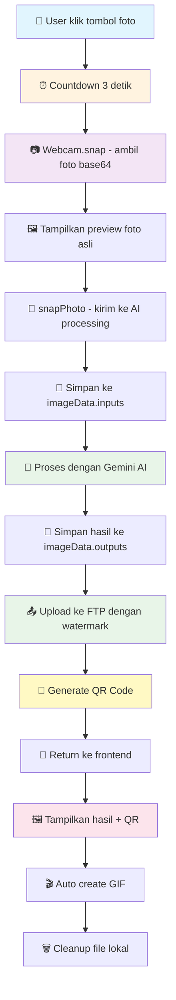

## 🎯 **DETAILED PROCESSING FLOW**

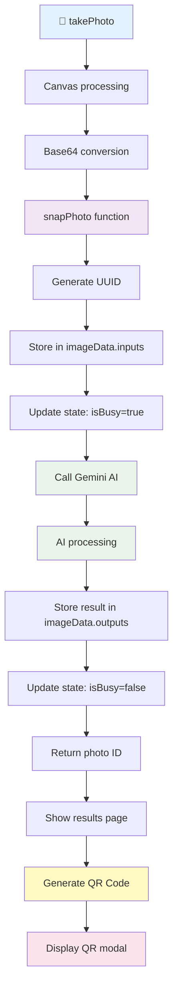

## 🤖 **AI PROCESSING DETAIL**

```mermaid
graph TD
    A[snapPhoto called] --> B[Get activeMode & customPrompt]
    B --> C[Generate unique ID]
    C --> D[Store base64 in imageData.inputs[id]]
    D --> E[Add photo to state with isBusy=true]
    E --> F[Call gen function]
    F --> G[Gemini API call]
    G --> H[Process with selected mode]
    H --> I[Return AI generated image]
    I --> J[Store result in imageData.outputs[id]]
    J --> K[Update state: isBusy=false]
    K --> L[Return photo ID]
    
    style A fill:#e3f2fd
    style F fill:#e8f5e8
    style G fill:#e8f5e8
    style H fill:#e8f5e8
    style I fill:#e8f5e8
    style L fill:#fce4ec
```

## 📤 **FTP UPLOAD PROCESS**

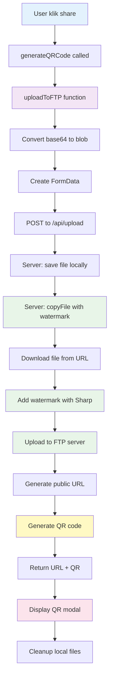

## 🎨 **WATERMARK PROCESS**

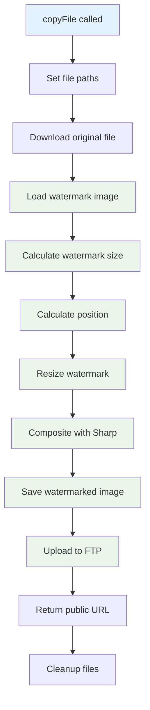

## 🎬 **GIF CREATION PROCESS**

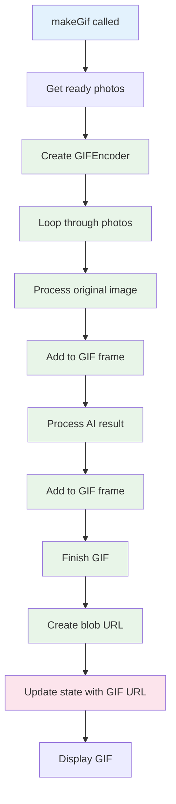

## 📱 **QR CODE GENERATION**

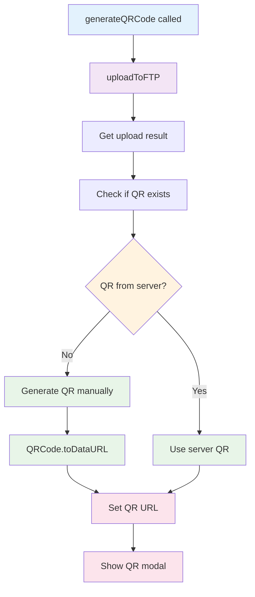

## 🔄 **STATE MANAGEMENT**

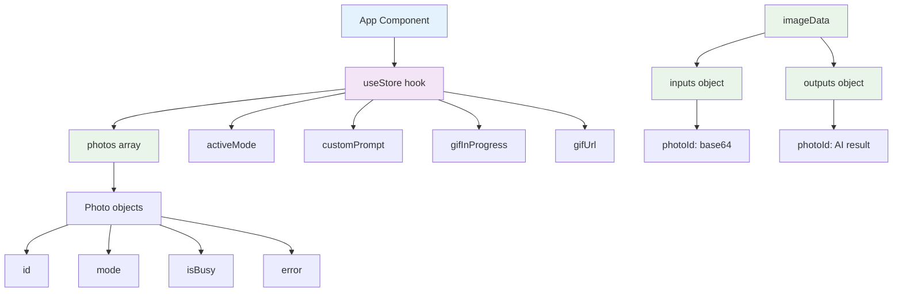

## 🛡️ **ERROR HANDLING FLOW**

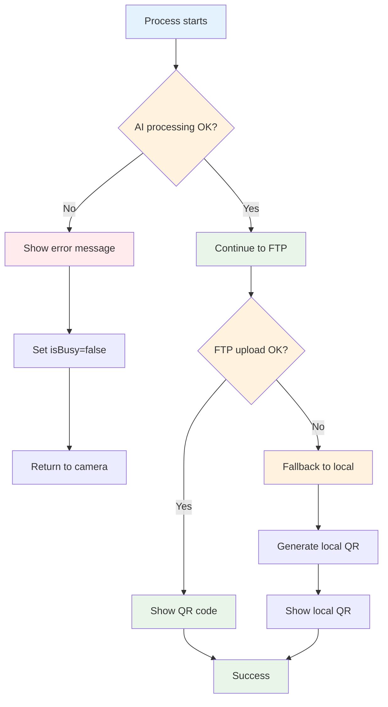

## 📊 **PERFORMANCE MONITORING**

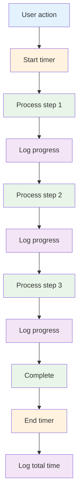

## 🎯 **USER INTERACTION FLOW**

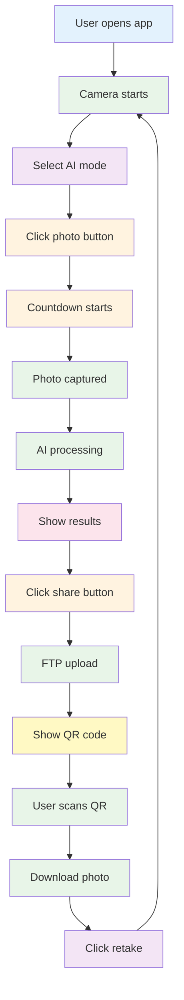

## 🔧 **CONFIGURATION FLOW**

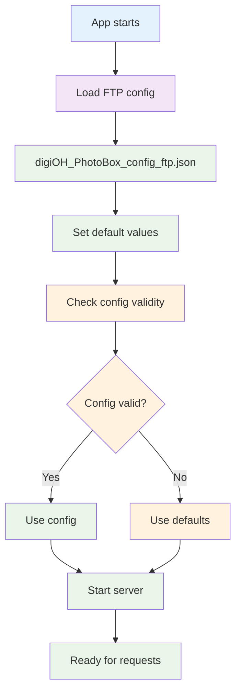

## 📱 **MOBILE RESPONSIVENESS**

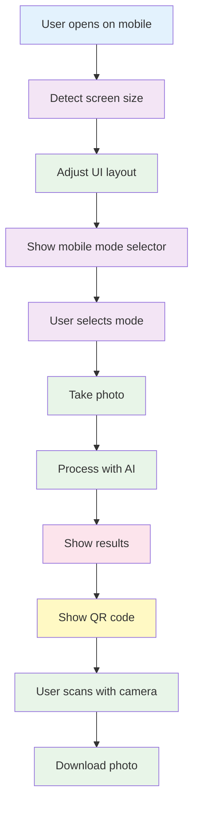

## 🎉 **FINAL RESULT FLOW**

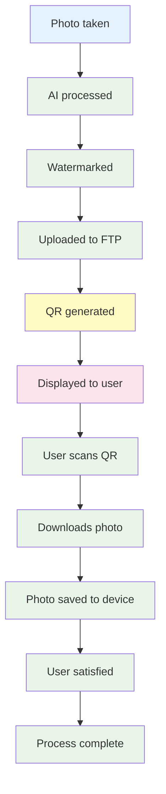

Sistem DigiOH Photobooth ini dirancang untuk memberikan pengalaman yang seamless dari pengambilan foto hingga sharing hasil! 🚀
