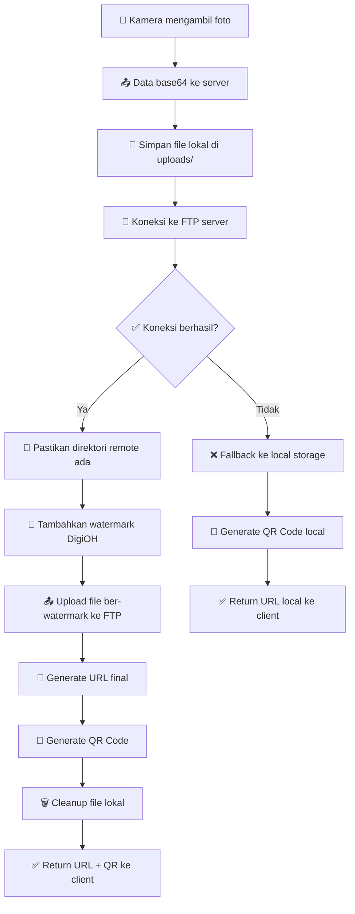
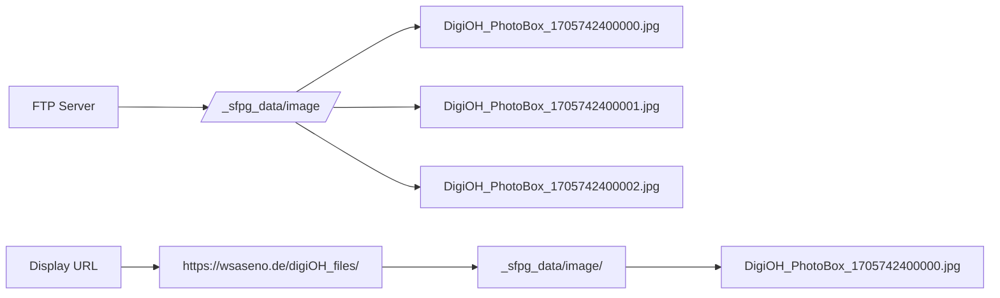
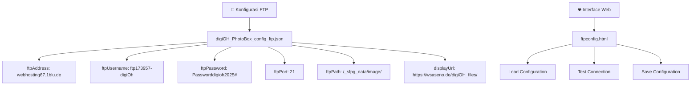
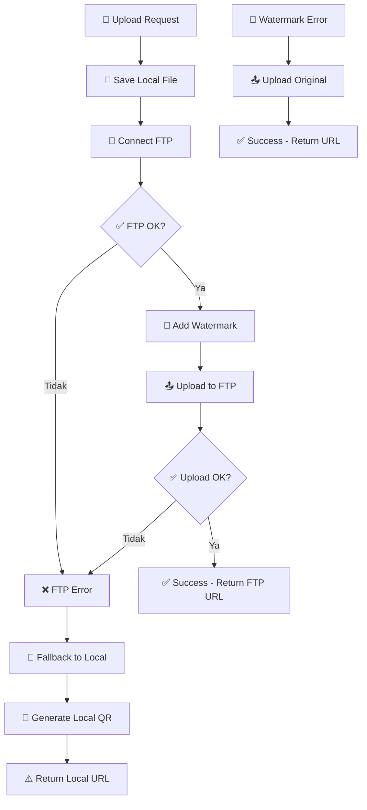
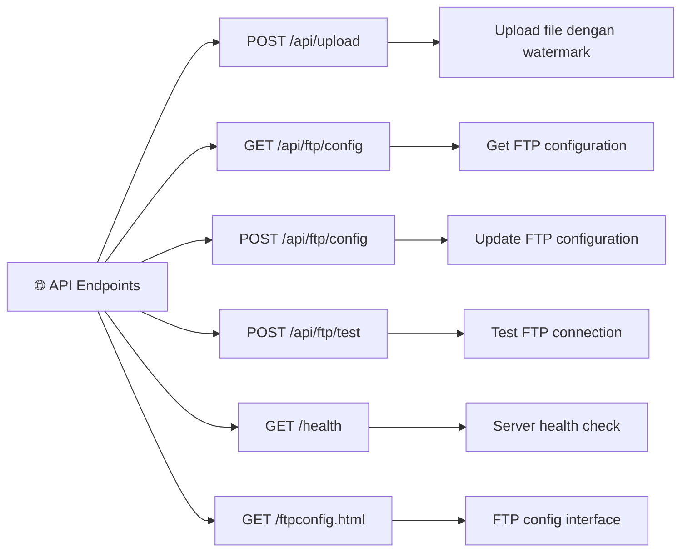
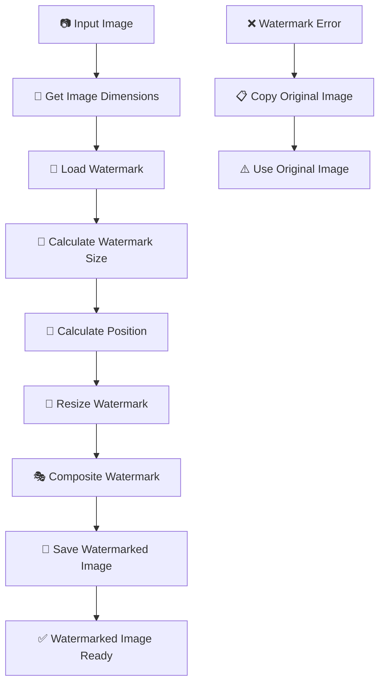
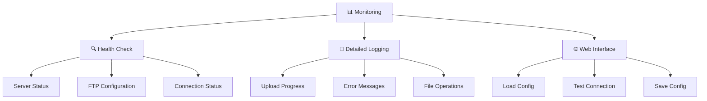
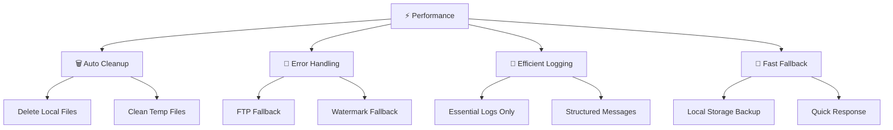

# 🔄 Diagram Alur FTP DigiOH Photobooth

## Alur Lengkap Upload FTP



## Struktur File FTP



## Konfigurasi FTP



## Error Handling Flow



## API Endpoints



## File Structure

```
Photobooth/
├── 📁 ftpUtils.js                    # Utilitas FTP lengkap
├── 📁 digiOH_PhotoBox_config_ftp.json # Konfigurasi FTP
├── 🖼️ watermarkdigioh.png            # File watermark
├── 📁 public/
│   └── 🌐 ftpconfig.html             # Interface konfigurasi
├── 📁 uploads/                       # Folder file lokal
│   ├── 📷 DigiOH_PhotoBox_1705742400000.jpg
│   ├── 🎨 watermarked_DigiOH_PhotoBox_1705742400000.jpg
│   └── 📷 DigiOH_PhotoBox_1705742400001.jpg
├── 📁 server.js                      # Server dengan endpoint FTP
└── 📁 SETUP_FTP_COMPLETE.md          # Dokumentasi lengkap
```

## Watermark Process



## Monitoring & Logging



## Performance Optimization



Sistem FTP ini dirancang untuk memberikan kontrol penuh atas file photobooth dengan watermark otomatis dan fallback yang robust! 🚀
